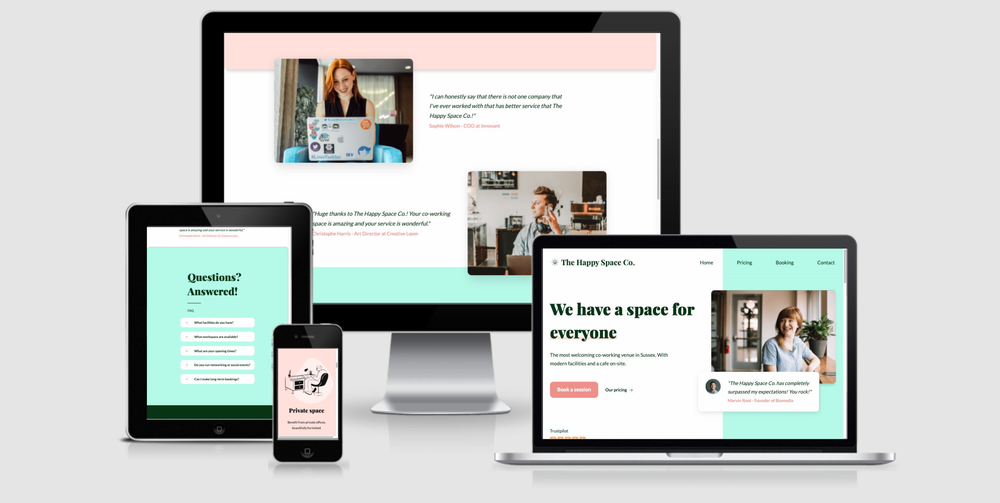

# The Happy Space Co.

_This document is a work in progress_

[Live webpage](https://lucywoodman.github.io/the-happy-space-co/)

## Table of contents

1. [Project goals](#project-goals)
2. [User experience](#user-experience)

## Project goals

The business goals of The Happy Co-Space

- Increase revenue from new visitors making bookings.
- Increase revenue from returning visitors making long-term bookings.
- Increase awareness of the venue as _the_ place to go for coworking.
- Provide a great user experience that visitors want to promote and share on social media.

The user goals

- Find a welcoming coworking space with modern facilities, such as fast internet, clean environment, and refreshments on site.
- Find the pricing and how to book.
- Find the location and contact details for the venue.

## User experience

The site is designed and built with a mobile-first approach to be fully responsive and available on any device. This is to ensure that it's easily accessible while on the go.

There is a simple navigation with concise links for the different pages of information. The information is well presented and visually appealing regardless of screen size.

Colour contrast is chosen with accessibility in mind, keeping the site easy to read.

### Target audience

- Entrepreneurs
- Remote workers
- Side-hustlers
- Local business owners

### User stories

#### First-time visitor

1. I run a local business and want to work alongside others for networking. Do you have networking events?
2. I run a local business and want to work alongside others for collaboration opportunities. Do you have open working areas?
3. I run a business alongside my main job and want an evening/weekend office space. What hours are you open?
4. I normally work alone and want to be alongside others for social reasons. Are there social areas?
5. I work remotely and don’t have an adequate office space at home. Can I rent a personal office space?
6. I work remotely and need a venue to run meetings and workshops. Do you have conference rooms with suitable facilities?
7. I’m visiting this area and want somewhere close to the town centre to work from. Where are you located?
8. I work remotely and I need an office space away from my noisy household. Do you have private and quiet offices?
9. I work remotely and need a reliable internet connection. How good is your internet?
10. I drink a lot of coffee when I’m working. Do you have coffee/tea on site? Are there toilets?

#### Returning visitor

1. I come here often. Can I get a discount for paying up front?
2. I need to ask a question/have a request for the owners. How can I get in touch?
3. I have a complaint. How do I contact you?
4. I had a great experience! Where can I leave a review?
5. I’d like to change my booking. How do I do that?

## Scope

The scope of the project in its initial release is defined by the following features:

-

## Features to be built in future releases:

## Design

### Colours

### Fonts

### Imagery

### Wireframes

## Features

The page consists of X pages and X features.

### 1. Feature

- Description
- User stories covered, 1, 4, 6

[Screenshot]

## Technologies used

### Languages

- HTML5
- CSS3
- JS

### Frameworks, libraries and other tools

1. Git
2. GitHub
3. Figma
4. Phosphoricons
5. Google Fonts
6. Unsplash
7. Am I Responsive
8. VSCode
9. Google Maps

## Validation

### HTML validation

The [W3C Markup Validation Service] was used to validate the HTML of the website. All pages pass with 0 errors and 0 warnings.

Home

### CSS validation

The [W3C Jigsaw CSS Validation Service] was used to validate the CSS of the website. The CSS passes with 0 errors and 0 warnings.

style.css

### Accessibility

The [WAVE WebAIM web accessibility evaluation tool] was used to ensure the website met high accessibility standards. All pages pass with 0 errors.

Home

### Performance

[Google Lighthouse] was used to test the performance of the website.

Home

### Performing tests on various devices

The website was tested on the following devices:

-

### Browser compatability

The website was tested on the following browsers:

- Microsoft Edge: notes of differences
- Google Chrome
- Firefox
- Safari

### Testing user stories

1. Repeat user stories, followed by a table with a feature or two to solve the issue. Example: I run a local business and want to work alongside others for networking. Do you have networking events? (terrible example, because I probably won't add events lol)

| **Feature**                 | **Action**                | **Expected Result**                                           | **Actual Result** |
| --------------------------- | ------------------------- | ------------------------------------------------------------- | ----------------- |
| Events section on home page | Scroll down the home page | To find information on networking events for local businesses | Works as expected |

Screenshots

## Bugs

| **Bug**         | **Fix** |
| --------------- | ------- |
| Bug explanation | Bug fix |

## Deployment

The website was deployed using GitHub Pages by following these steps:

1. In the GitHub repository navigate to the Settings tab
2. On the left hand menu select Pages
3. For the source select Branch: master
4. After the webpage refreshes automaticaly you will se a ribbon on the top saying: "Your site is published at..."

You can for fork the repository by following these steps:

1. Go to the GitHub repository
2. Click on Fork button in upper right hand corner

You can clone the repository by following these steps:

1. Go to the GitHub repository
2. Locate the Code button above the list of files and click it
3. Select if you prefere to clone using HTTPS, SSH, or Github CLI and click the copy button to copy the URL to your clipboard
4. Open Git Bash
5. Change the current working directory to the one where you want the cloned directory
6. Type git clone and paste the URL from the clipboard ($ git clone https://github.com/YOUR-USERNAME/YOUR-REPOSITORY)
   7.Press Enter to create your local clone.

## Credits

### Code

- Source - for code snippet, or blog post.

### Media

Unsplash was used for all imagery throughout the site. The license is copyright-free.
In order of apearance:

- Image description - [Unsplash link]

## Acknowledgements

I would like to take the opportunity to thank:

- My family, friends and colleagues for their advice, support and help with testing. Including Claud, Kate, Josh and Katja.
- My mentor Mo Shami for their feedback, advice and support.
