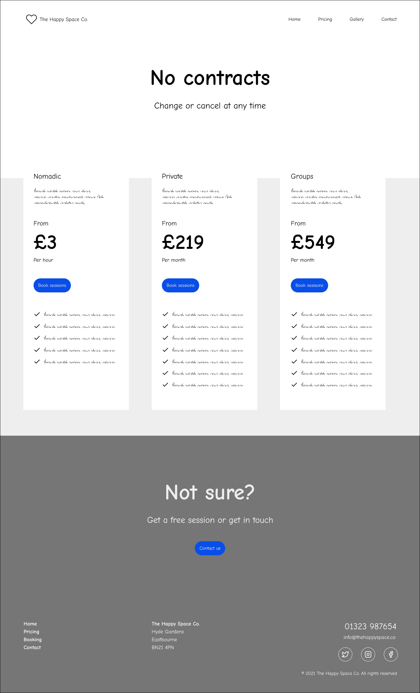
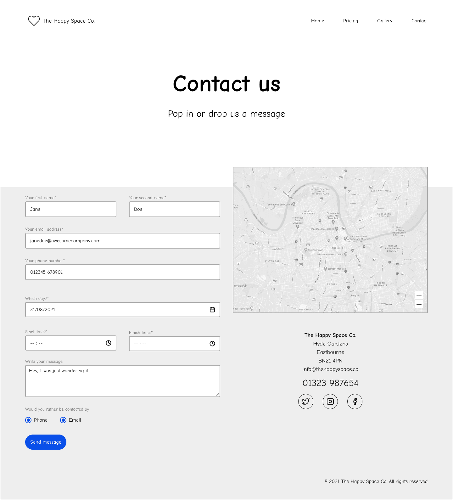
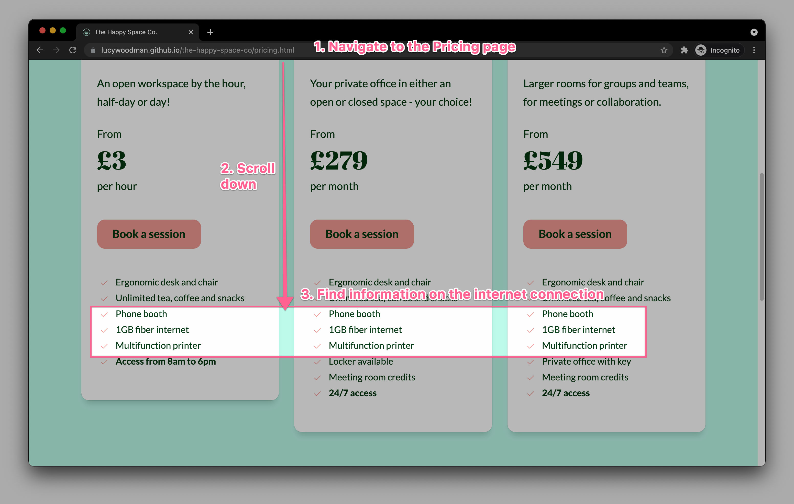

# The Happy Space Co.

_This document is a work in progress_

An inviting coworking space in the town center of Eastbourne. With modern facilities, cosy and relaxed decor and a cafe on site.

Visitors can reserve desk space, offices or conference rooms on a short or longterm basis.

[Live webpage](https://lucywoodman.github.io/the-happy-space-co/)

## Table of contents

1. [Project goals](#project-goals)
2. [User experience](#user-experience)
XXX

## Project goals

The user goals

- Find a welcoming coworking space with modern facilities.
- Find information about the facilities and workspaces available.
- Find the pricing and how to book.
- Find the location and contact details for the venue.

The business goals of The Happy Space Co.

- Increase revenue from new and return visitors making reservations.
- Increase awareness of the venue as the best place to go for coworking.
- Provide essential information and photos of the venue to new and returning visitors.
- Provide a way for visitors to contact the venue directly.

## User experience

### Target audience

- Entrepreneurs, looking for a place to work from or hold meetings. With opportunities for networking and collaboration.
- Remote workers, looking for a workspace alongside others for company, or as a venue for remote teams to come together.
- Side-hustlers, looking for a workspace with access outside of business hours.
- Local business owners, looking for networking or collaboration opportunities.

### User requirements and expectations

- A clear navigation that makes it easy to see what information is available on the site.
- A design-led experience that's a delight to see and use.
- A colour palette and typography that considers accessibility and readability.
- Links and functions that work as expected.
- Consistency across pages.
- Fully responsive for viewing on any device.

### User stories

#### First-time visitors

1. As an entrepreneur, I want to know if there are open workspaces, so that I can work alongside others for networking or collaboration opportunities.
2. As an entrepreneur, I want to know if I can have people visit my workspace, so I can continue my in-person meetings.
3. As a remote worker, I want to know if there are personal workspaces with good desks and chairs available, as I'm fed up of working from my sofa at home.
4. As a remote worker, I want to know what rooms are available for workshops, so that I can bring my team together for training once a month.
5. As a side-hustler, I want to know when I can use the workspaces, so that I can work in the evenings and weekends on my business.
6. As a local business owner, I want to know the cost of the workspaces, so that I can determine whether it is within budget.
7. As a non-local visitor, I want to know how close the venue is to the town center, so that I won't get lost in an area I don't know.
8. As a first time visitor, I want to know how good the internet connection is, so that I can be sure that I can run video calls without a hitch.
9. As a first time visitor, I want to know how to reserve workspaces, so I can make a booking.
10. As a first time visitor, I want to know where I can ask questions about the venue, so that I can get all the information I need before booking.

#### Returning visitors

11. As a returning visitor, I want to be able to submit feedback, so that the business owners can consider my thoughts for future website/venue updates.
12. As a returning visitor, I want a reminder of the address/see a map, so that I can plan my route.
13. As a returning visitor, I want a reminder of the phone number/email address, so that I can contact the venue directly with any questions.
14. As a returning visitor, I want to know the venue's social media accounts, so that I can share my location/experiences with friends/colleagues on social media.

#### Business owner

15. As the business owner, I want more bookings, so that my business can succeed.
16. As the business owner, I want to to show how amazing our service/venue is, so that I can feel proud and that everyone will talk about it.
17. As the business owner, I want a way for visitors to be able to contact me directly through the website, so that I can help with special requests.

## Design

Inspired by offices and coworking spaces I've used, as well as online interior design photos, I came up with the following keywords for the brand:

 - Welcoming
 - Modern
 - Creative
 - Classy

### Colours

The site is designed using a modern, bright and clean palette (modern, creative), with a warm and elegant dark green (welcoming, classy) in the footer and text. This is to reflect how the venue would look, carrying the same feel from the website to the coworking space. New visitors would already have a positive emotional response from the design and expect the same from the venue.

### Fonts

The classy font "Playfair Display" is used for the headers, and the modern "Lato" is used for almost everything else. I chose to use "Abril Fatface" for any digits on the site, as this matches the header font well but doesn't drop below the baseline like Playfair does. This makes it easier to read and keeps the space around the pricing even.

### Imagery

All of the photos were selected as complimentary to the design, as well as showing workspaces that fit the brand keywords. The colours within the photos reflect the branding, using dark greens (plants), oranges/pinks (furniture, wood) and whites.

Simple and modern line illustrations are used for the main features of the coworking space, as a creative alternative to using further photos on the home page. The same simple line style is used for the logo and icons.

### Structure

The website uses a well-known and well-experienced web design pattern, to provide a comforting and predictable experience to users. With the logo in the top left, navigation in the top right. Each page has a large "hero " section displaying the page title and each section is highlighted with a shift in background colour.

The header and footer on each of the longer pages matches, allowing users to quickly find their way around. There's also a call-to-action above the footer to encourage users to get in touch or make a booking.

The one page the does not entirely match is the contact page. As the user would already be contacting the venue or making a booking at this point, the call to action isn't required. As the page is quite short, the contact details are moved up from the footer into a more visible location and the footer links are removed.

### Wireframes

Home page

Pricing page

Gallery page

Contact page

## Features

The page consists of 4 pages and 10 features.

### 1. Logo and Navigation

The logo and navigation are predictably at the top of every page. They're fully responsive, with the navigation menu switching to a "hamburger" on smaller screens. All pages are included, and the currently active page is highlighted.

### 2. Hero section

The hero section welcomes visitors to the page with a headline, a description of what the company does and two call-to-action links for the primary business goals. The company is validated with social proof in the forms of a testimonial with user image, and a Trustpilot score.

The supporting images are inline with the overall brand. The main photo is looking back towards the headline to encourage visitors to return their focus to the left.

- User stories covered: 6, 9, 11, 15, 16.

### 3. Services section

The services section highlights the two main types of workspaces (private or open) as well as two benefits (common areas and 24/7 access). Each has a line illustration and a short description.

- User stories covered: 1, 3, 4.

### 4. Testimonial section

Two longer testimonials with supporting images, names and titles that act as additional social proof to reassure new visitors that the company offers an excellent service and experience. This ties into the primary business goal.

The images slightly overlap with the backgrounds of the previous and following sections, as a subtle nudge to encourage scrolling.

- User stories covered: 16.

### 5. FAQ section

The FAQ section uses non-obtrusive `
` HTML tags to keep the lengthy answers hidden away unless required. Users can open up whichever question they'd like to know the answer for.

- User stories covered: 1, 2, 3, 4, 5.

### 6. Call to action

The main call to action section is at the bottom of 3 of the pages. The home page and gallery page encourage visitors to make a booking, while the pricing page encourages visitors to get in touch. All link to the contact page. This is another opportunity to fulfill the primary business goal.

- User stories covered: 9, 15.

### 7. Footer

The footer provides a secondary menu that mirrors the navigation at the top of the page, to allow visitors to quickly find the other pages. It also provides the business address, phone number, email address and social media links. Lastly, there's a copyright statement at the bottom.

- User stories covered: 7, 10, 11, 12, 13, 14, 17.

### 8. Pricing page

The pricing page provides more detailed information on the different workspaces available and how much they cost. Each come with their own perks which are listed on each of the workspace cards. Every card has a call-to-action to encourage booking. 

At the bottom of this page, the main call-to-action has been tweaked to say "Not sure?" with a link to the saying "Contact us" instead of "Book a session". This is in the hope that if none of the price points suit the needs of the visitor, that they will contact the business instead.

- User stories covered: 1, 3, 4, 5, 6, 8, 9, 10, 15, 16, 17.

### 9. Gallery page

The gallery page uses a masonry grid style to display photos of the venue. All images are selected in keeping with the overall brand. They are also styled to match the other images on the site, with curved corners and a subtle shadow.

- User stories covered: 1, 3, 4, 16.

### 10. Contact page

The contact page contains a contact form on the left, and a Google map with contact details below on the right. The form has been styled in keeping with the brand, with lots of space to make it easy to use. It asks for a date and start/finish times for bookings, as well as using radio buttons for contact preference.

The map highlights the location of the venue within the town center. The contact details are the same as what is shown in the footer on the other pages, except brought higher up the page for better visibility. To avoid repeating content, the footer has been removed for this page (though the copyright remains).

- User stories covered: 7, 9, 10, 11, 12, 13, 14, 15, 17.

## Technologies used

### Languages

- HTML5
- CSS3
- JavaScript (a tiny bit for the responsive navigation)

### Frameworks and tools

Research, planning and wireframes

<ol>
   <li>VSCode (markdown)</li>
   <li>Dribbble, Huemint and SaaSpages for inspiration</li>
   <li>Invisionapp for moodboard</li>
   <li>Figma for wireframes and notes</li>
</ol>

Branding and design

<ol>
   <li>Figma</li>
   <li>Google Fonts and Phosphoricons</li>
   <li>Unsplash</li>
   <li>Figma Community's Indian Doodle Illustration Pack</li>
</ol>

Development

<ol>
   <li>Git and GitHub</li>
   <li>VSCode</li>
   <li>Figma's Favvy Favicon Exporter plugin</li>
   <li>Figma's TinyImage Compressor plugin</li>
   <li>TinyPNG for extra image compression</li>
   <li>Google maps</li>
</ol>

Docs

<ol>
   <li>VSCode (markdown)</li>
   <li>Am I Responsive for the mockup</li>
   <li>CloudApp for screenshots</li>
</ol>

## Validation

### HTML validation

The [W3C Markup Validation Service](https://validator.w3.org/) was used to validate the HTML of the website. All pages pass with 0 errors and 0 warnings.

Home page

Pricing page

Gallery page

Contact page

### CSS validation

The [W3C Jigsaw CSS Validation Service](https://jigsaw.w3.org/css-validator/) was used to validate the CSS of the website. The CSS passes with 0 errors. There are some warnings due to using CSS variables (custom properties), which the validator does not support yet. See the [CSS Validator's GitHub](https://github.com/w3c/css-validator/pull/173#issuecomment-878349650) for more information.

style.css

### Accessibility

The [WAVE WebAIM web accessibility evaluation tool](https://wave.webaim.org/) was used to ensure the website met high accessibility standards. All pages pass with 0 errors.

Home page

Pricing page

Gallery page

Contact page

### Performance

[Google Lighthouse](https://developers.google.com/web/tools/lighthouse) was used to test the performance of the website.

Home page

Pricing page

Gallery page

Contact page

### Performing tests on various devices

The website was tested on the following devices:

- Apple MacBook Pro, Apple MacBook Air
- iPhone X, iPhone 8, iPhone SE
- Huawei P30 Pro

### Browser compatability

The website was tested on the following browsers:

- Microsoft Edge
- Google Chrome
- Firefox
- Safari: An odd issue with the first FAQ item where the white background has chunks missing. Also, the map takes up more space on the contact page.

### Testing user stories

1. As an entrepreneur, I want to know if there are open workspaces, so that I can work alongside others for networking or collaboration opportunities.

| **Feature**                 | **Action**                | **Expected Result**                                           | **Actual Result** |
| --------------------------- | ------------------------- | ------------------------------------------------------------- | ----------------- |
| Services section on the home page | Scroll down the home page | To find information on the workspaces | Works as expected |
| FAQ section on the home page | Scroll down the home page | To find information on the workspaces | Works as expected |
| Pricing page | Navigate to the Pricing page, scroll down | To find information on the workspaces | Works as expected |
| Gallery page | Navigate to the Gallery page, scroll down | To find photos of the workspaces | Works as expected |

Screenshots

2. As an entrepreneur, I want to know if I can have people visit my workspace, so I can continue my in-person meetings.

| **Feature**                 | **Action**                | **Expected Result**                                           | **Actual Result** |
| --------------------------- | ------------------------- | ------------------------------------------------------------- | ----------------- |
| FAQ section on the home page | Scroll down the home page | To find information on visitors to workspaces | Works as expected |

Screenshots

3. As a remote worker, I want to know if there are personal workspaces with good desks and chairs available, as I'm fed up of working from my sofa at home.

| **Feature**                 | **Action**                | **Expected Result**                                           | **Actual Result** |
| --------------------------- | ------------------------- | ------------------------------------------------------------- | ----------------- |
| Services section on the home page | Scroll down the home page | To find information on the workspaces | Works as expected |
| FAQ section on the home page | Scroll down the home page | To find information on the workspaces | Works as expected |
| Pricing page | Navigate to the Pricing page, scroll down | To find information on the workspaces | Works as expected |
| Gallery page | Navigate to the Gallery page, scroll down | To find photos of the workspaces | Works as expected |

Screenshots

4. As a remote worker, I want to know what rooms are available for workshops, so that I can bring my team together for training once a month.

| **Feature**                 | **Action**                | **Expected Result**                                           | **Actual Result** |
| --------------------------- | ------------------------- | ------------------------------------------------------------- | ----------------- |
| Services section on the home page | Scroll down the home page | To find information on the workspaces | Works as expected |
| FAQ section on the home page | Scroll down the home page | To find information on the workspaces | Works as expected |
| Pricing page | Navigate to the Pricing page, scroll down | To find information on the workspaces | Works as expected |
| Gallery page | Navigate to the Gallery page, scroll down | To find photos of the workspaces | Works as expected |

Screenshots

5. As a side-hustler, I want to know when I can use the workspaces, so that I can work in the evenings and weekends on my business.

| **Feature**                 | **Action**                | **Expected Result**                                           | **Actual Result** |
| --------------------------- | ------------------------- | ------------------------------------------------------------- | ----------------- |
| FAQ section on the home page | Scroll down the home page | To find information on the office hours | Works as expected |
| Pricing page | Navigate to the Pricing page, scroll down | To find information on the office hours | Works as expected |

Screenshots

6. As a local business owner, I want to know the cost of the workspaces, so that I can determine whether it is within budget.

| **Feature**                 | **Action**                | **Expected Result**                                           | **Actual Result** |
| --------------------------- | ------------------------- | ------------------------------------------------------------- | ----------------- |
| Pricing page | Navigate to the Pricing page, scroll down | To find information on the pricing | Works as expected |

Screenshots

7. As a non-local visitor, I want to know how close the venue is to the town center, so that I won't get lost in an area I don't know.

| **Feature**                 | **Action**                | **Expected Result**                                           | **Actual Result** |
| --------------------------- | ------------------------- | ------------------------------------------------------------- | ----------------- |
| Footer on any page | Scroll down any page | To find information on the venue location | Works as expected |
| Contact page | Navigate to the Contact page, scroll down | To find information on the venue location with a map | Works as expected |

Screenshots

8. As a first time visitor, I want to know how good the internet connection is, so that I can be sure that I can run video calls without a hitch.

| **Feature**                 | **Action**                | **Expected Result**                                           | **Actual Result** |
| --------------------------- | ------------------------- | ------------------------------------------------------------- | ----------------- |
| Pricing page | Navigate to the Pricing page, scroll down | To find information on the the internet speed | Works as expected |

Screenshots

9. As a first time visitor, I want to know how to reserve workspaces, so I can make a booking.

| **Feature**                 | **Action**                | **Expected Result**                                           | **Actual Result** |
| --------------------------- | ------------------------- | ------------------------------------------------------------- | ----------------- |
| Hero section on the homepage | None - top of home page | Find next steps to book | Works as expected |
| Call to action on any page | Scroll down on home page or gallery page | Find next steps to book | Works as expected |
| Pricing page | Navigate to Pricing page, scroll down | Find next steps to book | Works as expected |
| Contact page | Navigate to the Contact page, scroll down | Make a booking | Works as expected |

Screenshots

10. As a first time visitor, I want to know where I can ask questions about the venue, so that I can get all the information I need before booking.

| **Feature**                 | **Action**                | **Expected Result**                                           | **Actual Result** |
| --------------------------- | ------------------------- | ------------------------------------------------------------- | ----------------- |
| Footer on any page | Scroll down any page | Find contact information | Works as expected |
| Call to action on Pricing page | Navigate to Pricing page, scroll down | Find where to contact | Works as expected |
| Contact page | Navigate to the Contact page, scroll down | Find contact information | Works as expected |

Screenshots

11. As a returning visitor, I want to be able to submit feedback, so that the business owners can consider my thoughts for future website/venue updates.

| **Feature**                 | **Action**                | **Expected Result**                                           | **Actual Result** |
| --------------------------- | ------------------------- | ------------------------------------------------------------- | ----------------- |
| Hero section on home page | Scroll down home page | Find review information | Works as expected |
| Footer on any page | Scroll down any page | Find contact information | Works as expected |
| Contact page | Navigate to the Contact page, scroll down | Find contact information | Works as expected |

Screenshots

12. As a returning visitor, I want a reminder of the address/see a map, so that I can plan my route.

| **Feature**                 | **Action**                | **Expected Result**                                           | **Actual Result** |
| --------------------------- | ------------------------- | ------------------------------------------------------------- | ----------------- |
| Footer on any page | Scroll down any page | To find the venue address | Works as expected |
| Contact page | Navigate to the Contact page, scroll down | To find the venue address with a map | Works as expected |

Screenshots

13. As a returning visitor, I want a reminder of the phone number/email address, so that I can contact the venue directly with any questions.

| **Feature**                 | **Action**                | **Expected Result**                                           | **Actual Result** |
| --------------------------- | ------------------------- | ------------------------------------------------------------- | ----------------- |
| Footer on any page | Scroll down any page | To find the phone number or email address | Works as expected |
| Contact page | Navigate to the Contact page, scroll down | To find the phone number or email address | Works as expected |

Screenshots

14. As a returning visitor, I want to know the venue's social media accounts, so that I can share my location/experiences with friends/colleagues on social media.

| **Feature**                 | **Action**                | **Expected Result**                                           | **Actual Result** |
| --------------------------- | ------------------------- | ------------------------------------------------------------- | ----------------- |
| Footer on any page | Scroll down any page | To find the social media links | Works as expected |
| Contact page | Navigate to the Contact page, scroll down | To find the the social media links | Works as expected |

Screenshots

15. As the business owner, I want more bookings, so that my business can succeed.

| **Feature**                 | **Action**                | **Expected Result**                                           | **Actual Result** |
| --------------------------- | ------------------------- | ------------------------------------------------------------- | ----------------- |
| Hero section on the homepage | None - top of home page | See booking CTA | Works as expected |
| Call to action on any page | Scroll down on home page or gallery page | See booking CTA | Works as expected |
| Pricing page | Navigate to Pricing page, scroll down | See booking CTA | Works as expected |
| Contact page | Navigate to the Contact page, scroll down | See form for booking | Works as expected |

Screenshots

16. As the business owner, I want to to show how amazing our service/venue is, so that I can feel proud and that everyone will talk about it.

| **Feature**                 | **Action**                | **Expected Result**                                           | **Actual Result** |
| --------------------------- | ------------------------- | ------------------------------------------------------------- | ----------------- |
| Hero section on home page | None - top of home page | See social proof | Works as expected |
| Testimonial section on home page | Scroll down home page | See testimonials | Works as expected |
| Pricing page | Navigate to Pricing page, scroll down | See detailed information on services | Works as expected |
| Gallery page | Navigate to Gallery page, scroll down | See photography of venue | Works as expected |

Screenshots

17. As the business owner, I want a way for visitors to be able to contact me directly through the website, so that I can help with special requests.

| **Feature**                 | **Action**                | **Expected Result**                                           | **Actual Result** |
| --------------------------- | ------------------------- | ------------------------------------------------------------- | ----------------- |
| Footer on any page | Scroll down any page | See contact information | Works as expected |
| Call to action on Pricing page | Navigate to Pricing page, scroll down | See CTA | Works as expected |
| Contact page | Navigate to the Contact page, scroll down | See contact information | Works as expected |

Screenshots

## Bugs

| **Bug**         | **Fix** |
| --------------- | ------- |
| Bug explanation | Bug fix |
| Button hover states aren't working correctly | Move `.button` class from the `<li>` to the `<a>` element |
| Menu button looks ugly after adding mobile navigation | This is because the navigation relies on `display: block-inline`, which messes up the button styling. This could have been fixed with some CSS changes, but I opted to remove the button instead |
| Logo image sits above logo after adding mobile navigation | Move it to inside the logo's `<li>` element. |
| Logo breaks into two lines on smaller screens | Reduce the font size for smaller screens |
| FAQ items are not using the full width available | Remove width restriction from FAQ answer `
` elements |
| Pricing cards are not spaced correctly | Reduce padding on the cards and add a width of 33% |
| Pricing cards do not align at the top after adding responsiveness | Add `align-items: flex-start` to parent container |
| Map is not responsive | Remove width and height from the iframe and add extra CSS as per [this GitHub Gist](https://gist.github.com/magnetikonline/8487169) |
| Safari shows triangles for `
` tag, even though it's hidden in the CSS | Set `summary::-webkit-details-marker` to `display: none;` |
| Mobile menu toggle causes accessibility checker to fail | Give the link an `aria-label` |

## Deployment

The website was deployed using GitHub Pages by following these steps:

1. In the GitHub repository navigate to the Settings tab
2. On the left hand menu select Pages
3. For the source select Branch: master
4. After the webpage refreshes automaticaly you will se a ribbon on the top saying: "Your site is published at..."

You can for fork the repository by following these steps:

1. Go to the GitHub repository
2. Click on Fork button in upper right hand corner

You can clone the repository by following these steps:

1. Go to the GitHub repository
2. Locate the Code button above the list of files and click it
3. Select if you prefere to clone using HTTPS, SSH, or Github CLI and click the copy button to copy the URL to your clipboard
4. Open Git Bash
5. Change the current working directory to the one where you want the cloned directory
6. Type git clone and paste the URL from the clipboard ($ git clone https://github.com/YOUR-USERNAME/YOUR-REPOSITORY)
7. Press Enter to create your local clone.

## Credits

### Media

Unsplash was used for all photos throughout the site. The license is copyright-free.
In order of apearance:

- Woman sitting by a window (hero) - [Brooke Cagle](https://unsplash.com/photos/NoRsyXmHGpI)
- Smiling man (hero testimonial) - [Ben Parker](https://unsplash.com/photos/OhKElOkQ3RE)
- Female software engineer (first testimonial) - [ThisisEngineering](https://unsplash.com/photos/69wEv-G2W_s)
- Person holding phone (second testimonial) - [Austin Distel](https://unsplash.com/photos/qgdJX9mvMJI)
- Woman using laptop (gallery) - [Brooke Cagle](https://unsplash.com/photos/xcgh5_-QIXc)
- Coworking office space (gallery) - [Andrea Davis](https://unsplash.com/photos/04G19lnpHcc)
- Home interior design (gallery) - [Andrea Davis](https://unsplash.com/photos/w-ARisGf_Kw)
- Coworking office space (gallery) - [CoWomen](https://unsplash.com/photos/XRGzgDmfjdw)
- People standing on grey tiles (gallery) - [Ian Schneider](https://unsplash.com/photos/TamMbr4okv4)
- Empty restaurant (gallery) - [Mengyi](https://unsplash.com/photos/CBGuFZoC6Mw)
- Three people around a table (gallery) - [Brooke Cagle](https://unsplash.com/photos/g1Kr4Ozfoac)
- Office desk space (gallery) - [Andrea Davis](https://unsplash.com/photos/GtqN1cTGocE)
- WeWork Richmond (gallery) - [Eloise Ambursley](https://unsplash.com/photos/iRZqkdb8gK8)

For the illustrations:

- [Figma Community - Indian Doodle Pack](https://www.figma.com/community/file/892381006526736549)

For the icons:

- [Phosphoricons](https://phosphoricons.com/)

### Code

- [techbriefers.com](https://techbriefers.com/how-to-create-a-half-border-design-and-fixed-width-border-design-in-css/) - a blog post about a fixed width border. Referred to for the mini dividers throughout the site.
- [webdesign.tutsplus.com](https://webdesign.tutsplus.com/tutorials/how-to-build-a-responsive-navigation-bar-with-flexbox--cms-33535) - a blog post on how to build a mobile navigation. Referred to for the site's mobile navigation.
- [morioh.com](https://morioh.com/p/8ed37dfd6b7d) - a tutorial for a FAQ accordion. Referred to for the site's FAQ section on the home page.
- [Andreas Storm](https://codepen.io/avstorm/pen/eYNLwVd) on Codepen - an example of radio input styling. Referred to for the site's contact page.
- [GitHub Gist](https://gist.github.com/magnetikonline/8487169) - responsive Google Map embedding. Used for the site's contact page.

### Reference material

- [MDN Web Docs](https://developer.mozilla.org/en-US/) - general syntax reference.
- [CSS Tricks](https://css-tricks.com/snippets/css/a-guide-to-flexbox/) - flexbox reference.

### Other
- [Namelix](https://namelix.com/app/?keywords=creative+technology) - startup name generator for testimonials
- [Testimonial generator](https://testimonial-generator.com/index.php) - for testimonials

## Acknowledgements

I would like to take the opportunity to thank:

- My family, friends and colleagues for their advice, support and help with testing.
- My mentor Mo Shami for their feedback, advice and support.
- Code Institute Slack for advice.