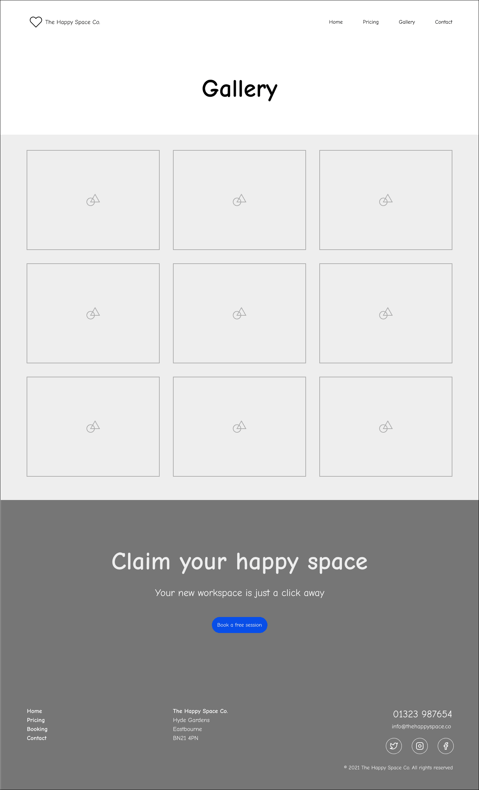
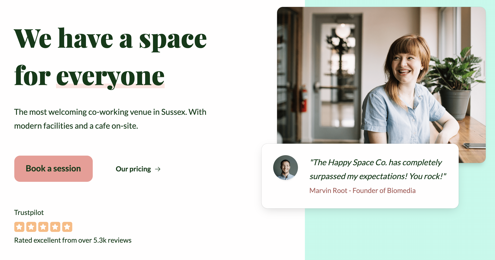
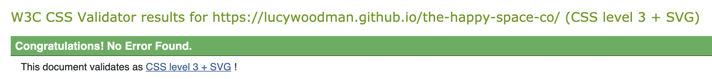

# The Happy Space Co.

_This document is a work in progress_

An inviting coworking space in the town center of Eastbourne. With modern facilities, cosy and relaxed decor and a cafe on site.

Visitors can reserve desk space, offices or conference rooms on a short or longterm basis.

[Live webpage](https://lucywoodman.github.io/the-happy-space-co/)

## Table of contents

1. [Project goals](#project-goals)
2. [User experience](#user-experience)
XXX

## Project goals

The user goals

- Find a welcoming coworking space with modern facilities.
- Find information about the facilities and workspaces available.
- Find the pricing and how to book.
- Find the location and contact details for the venue.

The business goals of The Happy Space Co.

- Increase revenue from new and return visitors making reservations.
- Increase awareness of the venue as the best place to go for coworking.
- Provide essential information and photos of the venue to new and returning visitors.
- Provide a way for visitors to contact the venue directly.

## User experience

### Target audience

- Entrepreneurs, looking for a place to work from or hold meetings. With opportunities for networking and collaboration.
- Remote workers, looking for a workspace alongside others for company, or as a venue for remote teams to come together.
- Side-hustlers, looking for a workspace with access outside of business hours.
- Local business owners, looking for networking or collaboration opportunities.

### User requirements and expectations

- A clear navigation that makes it easy to see what information is available on the site.
- A design-led experience that's a delight to see and use.
- A colour palette and typography that considers accessibility and readability.
- Links and functions that work as expected.
- Consistency across pages.
- Fully responsive for viewing on any device.

### User stories

#### First-time visitor

1. I run a local business and want to work alongside others for networking or collaboration opportunities. Do you have open working areas?
2. I run a business alongside my main job and want an evening/weekend office space. What hours are you open?
3. I'm researching options for myself/my company. How much does it cost?
4. I work remotely and don’t have an adequate office space at home. Can I rent a personal office space?
5. I work remotely and need a venue to run meetings and workshops. Do you have conference rooms with suitable facilities?
6. I’m visiting this area and want somewhere close to the town centre to work from. Where are you located?
7. I work remotely and I need an office space away from my noisy household. Do you have private and quiet offices?
8. I need a reliable internet connection for lots of video calls. How good is your internet?
9. My job involves lots of in-person meetings. Can I have visitors?

#### Returning visitor

10. I plan to be a regular visitor! How do I make long-term bookings?
11. I need to ask a question/have a request for the owners. How can I get in touch?
12. I need a reminder of when I can visit. What are your opening hours?
13. I had a great experience! Where can I leave a review?
14. I can't remember your location. What's your address?
15. I want to share your business with my friends/colleagues on social media. What are your social media accounts?

#### Business owner

16. I want my business to succeed, and to do that, I need more bookings.
17. I'm proud of my business and want to tell everyone about it. How can we show how amazing our service is?
18. I need a way for visitors to be able to contact me directly to ask questions or make requests.

## Design

Inspired by offices and coworking spaces I've used, as well as online interior design photos, I came up with the following keywords for the brand:

 - Welcoming
 - Modern
 - Creative
 - Classy

### Colours

The site is designed using a modern, bright and clean palette (modern, creative), with a warm and elegant dark green (welcoming, classy) in the footer and text. This is to reflect how the venue would look, carrying the same feel from the website to the coworking space. New visitors would already have a positive emotional response from the design and expect the same from the venue.

[XXX ADD PALETTE HERE]

### Fonts

The classy font "Playfair Display" is used for the headers, and the modern "Lato" is used for almost everything else. I chose to use "Abril Fatface" for any digits on the site, as this matches the header font well but doesn't drop below the baseline like Playfair does. This makes it easier to read and keeps the space around the pricing even.

[XXX ADD FONTS AND NUMERALS HERE]

### Imagery

All of the photos were selected as complimentary to the design, as well as showing workspaces that fit the brand keywords. The colours within the photos reflect the branding, using dark greens (plants), oranges/pinks (furniture, wood) and whites.

Simple and modern line illustrations are used for the main features of the coworking space, as a creative alternative to using further photos on the home page. The same simple line style is used for the logo and icons.

[XXX ADD SOMETHING HERE]

### Structure

The website uses a well-known and well-experienced web design pattern, to provide a comforting and predictable experience to users. With the logo in the top left, navigation in the top right. Each page has a large "hero " section displaying the page title and each section is highlighted with a shift in background colour.

The header and footer on each of the longer pages matches, allowing users to quickly find their way around. There's also a call-to-action above the footer to encourage users to get in touch or make a booking.

The one page the does not entirely match is the contact page. As the user would already be contacting the venue or making a booking at this point, the call to action isn't required. As the page is quite short, the contact details are moved up from the footer into a more visible location and the footer links are removed.

### Wireframes

Home page

Pricing page

Gallery page

Contact page

## Features

The page consists of 4 pages and XXX features.

### 1. Logo and Navigation

The logo and navigation are predictably at the top of every page. They're fully responsive, with the navigation menu switching to a "hamburger" on smaller screens. All top level pages are included, and the currently active page is highlighted.

### 2. Hero section

The hero section welcomes visitors to the page with a headline, a description of what the company does and two call-to-action links for the primary business goals. The company is validated with social proof in the forms of a testimonial with user image, and a Trustpilot score.

The supporting images are inline with the overall brand. The main photo is looking back towards the headline to encourage visitors to return their focus to the left.

- User stories covered: 3, 10, 13, 16, 17

### 3. Services section

The services section highlights the two main types of workspaces (private or open) as well as two benefits (common areas and 24/7 access). Each has a line illustration and a short description.

- User stories covered: 1, 2, 4, 7, 12

### 4. Testimonial section

Two longer testimonials with supporting images, names and titles that act as additional social proof to reassure new visitors that the company offers an excellent service and experience. This ties into the primary business goal.

The images slightly overlap with the backgrounds of the previous and following sections, as a subtle nudge to encourage scrolling.

- User stories covered: 17

### 5. FAQ section

The FAQ section uses non-obtrusive `
` HTML tags to keep the lengthy answers hidden away unless required. Users can open up whichever question they'd like to know the answer for.

- User stories covered: 1, 2, 4, 5, 7, 8, 9, 12

### 6. Call to action

The main call to action section is at the bottom of 3 of the pages. The home page and gallery page encourage visitors to make a booking, while the pricing page encourages visitors to get in touch. All link to the contact page. This is another opportunity to fulfill the primary business goal.

- User stories covered: 16

### 7. Footer

The footer provides a secondary menu that mirrors the navigation at the top of the page, to allow visitors to quickly find the other pages. It also provides the business address, phone number, email address and social media links. Lastly, there's a copyright statement at the bottom.

- User stories covered: 6, 11, 13, 14, 15, 17, 18

### 8. Pricing page

The pricing page provides more detailed information on the different workspaces available and how much they cost. Each come with their own perks which are listed on each of the workspace cards. Every card has a call-to-action to encourage booking. 

At the bottom of this page, the main call-to-action has been tweaked to say "Not sure?" with a link to the saying "Contact us" instead of "Book a session". This is in the hope that if none of the price points suit the needs of the visitor, that they will contact the business instead.

- User stories covered: 1, 2, 3, 4, 5, 7, 8, 10, 12, 16, 17

### 9. Gallery page

The gallery page uses a masonry grid style to display photos of the venue. All images are selected in keeping with the overall brand. They are also styled to match the other images on the site, with curved corners and a subtle shadow.

- User stories covered: 1, 17

### 10. Contact page

The contact page contains a contact form on the left, and a Google map with contact details below on the right. The form has been styled in keeping with the brand, with lots of space to make it easy to use. It asks for a date and start/finish times for bookings, as well as using radio buttons for contact preference.

The map highlights the location of the venue within the town center. The contact details are the same as what is shown in the footer on the other pages, except brought higher up the page for better visibility. To avoid repeating content, the footer has been removed for this page (though the copyright remains).

- User stories covered: 6, 10, 11, 14, 15, 16, 18

## Technologies used

### Languages

- HTML5
- CSS3
- JavaScript (a tiny bit for the responsive navigation)

### Frameworks, libraries and other tools

1. Git
2. GitHub
3. VSCode
4. Figma
5. Phosphoricons
6. Google Fonts
7. Unsplash
8. Am I Responsive
9. Google Maps

## Validation

### HTML validation

The [W3C Markup Validation Service](https://validator.w3.org/) was used to validate the HTML of the website. All pages pass with 0 errors and 0 warnings.

Home page

Pricing page

Gallery page

Contact page

### CSS validation

The [W3C Jigsaw CSS Validation Service](https://jigsaw.w3.org/css-validator/) was used to validate the CSS of the website. The CSS passes with 0 errors. There are some warnings due to using CSS variables (custom properties), which the validator does not support yet. See the [CSS Validator's GitHub](https://github.com/w3c/css-validator/pull/173#issuecomment-878349650) for more information.

style.css

### Accessibility

The [WAVE WebAIM web accessibility evaluation tool](https://wave.webaim.org/) was used to ensure the website met high accessibility standards. All pages pass with 0 errors.

Home page

Pricing page

Gallery page

Contact page

### Performance

[Google Lighthouse](https://developers.google.com/web/tools/lighthouse) was used to test the performance of the website.

Home page

Pricing page

Gallery page

Contact page

### Performing tests on various devices

The website was tested on the following devices:

-

### Browser compatability

The website was tested on the following browsers:

- Microsoft Edge: notes of differences
- Google Chrome
- Firefox
- Safari

### Testing user stories

1. Repeat user stories, followed by a table with a feature or two to solve the issue. Example: I run a local business and want to work alongside others for networking. Do you have networking events? (terrible example, because I probably won't add events lol)

| **Feature**                 | **Action**                | **Expected Result**                                           | **Actual Result** |
| --------------------------- | ------------------------- | ------------------------------------------------------------- | ----------------- |
| Events section on home page | Scroll down the home page | To find information on networking events for local businesses | Works as expected |

Screenshots

## Bugs

| **Bug**         | **Fix** |
| --------------- | ------- |
| Bug explanation | Bug fix |

## Deployment

The website was deployed using GitHub Pages by following these steps:

1. In the GitHub repository navigate to the Settings tab
2. On the left hand menu select Pages
3. For the source select Branch: master
4. After the webpage refreshes automaticaly you will se a ribbon on the top saying: "Your site is published at..."

You can for fork the repository by following these steps:

1. Go to the GitHub repository
2. Click on Fork button in upper right hand corner

You can clone the repository by following these steps:

1. Go to the GitHub repository
2. Locate the Code button above the list of files and click it
3. Select if you prefere to clone using HTTPS, SSH, or Github CLI and click the copy button to copy the URL to your clipboard
4. Open Git Bash
5. Change the current working directory to the one where you want the cloned directory
6. Type git clone and paste the URL from the clipboard ($ git clone https://github.com/YOUR-USERNAME/YOUR-REPOSITORY)
   7.Press Enter to create your local clone.

## Credits

### Code

- Source - for code snippet, or blog post.

### Media

Unsplash was used for all imagery throughout the site. The license is copyright-free.
In order of apearance:

- Image description - [Unsplash link]

## Acknowledgements

I would like to take the opportunity to thank:

- My family, friends and colleagues for their advice, support and help with testing. Including Claud, Kate, Josh and Katja.
- My mentor Mo Shami for their feedback, advice and support.
